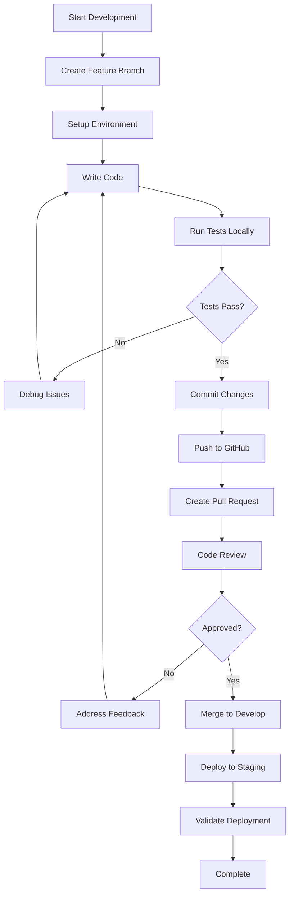
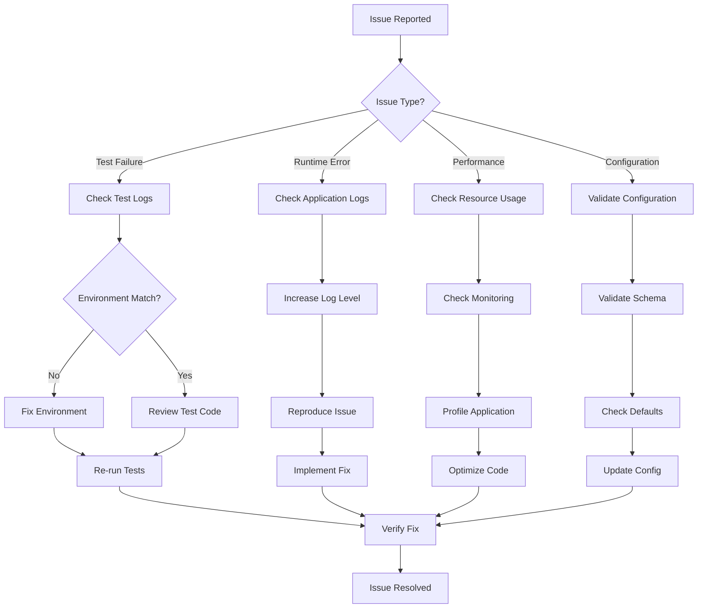

# FedLoad Development Guide

This document provides comprehensive development setup, environment configuration, debugging procedures, and troubleshooting guidelines for FedLoad contributors and maintainers.

## 🎯 Purpose

This guide is for developers who need to:
- Set up the development environment
- Understand the development workflow
- Debug issues and troubleshoot problems
- Follow best practices for code changes
- Maintain code quality and testing standards

**For project overview and user instructions, see README.md**  
**For planned features and development roadmap, see TODO.md**

## 🔧 Development Workflow Rules

### 1. Branch Management
```bash
# ALWAYS verify current branch before starting work
git branch --show-current

# Work on develop branch for features
git checkout develop

# Only merge to main after testing
```

**Key Rules:**
- ✅ Always check current branch before making changes
- ✅ Use `develop` branch for feature development
- ✅ Only merge to `main` after thorough testing
- ❌ Never work directly on `main` branch

### 2. Environment Setup
```bash
# ALWAYS activate virtual environment first
.venv\Scripts\Activate.ps1  # Windows
source .venv/bin/activate   # Linux/Mac

# Verify environment
python --version
which python  # Should show .venv path
```

**Key Rules:**
- ✅ Always activate virtual environment before any Python operations
- ✅ Verify Python version (should be 3.12.x)
- ✅ Confirm virtual environment path in prompt
- ❌ Never run Python commands without virtual environment

### 3. Testing Protocol
```bash
# Run tests before any major changes
python -m pytest tests/ -v

# Run linting on project files only
python -m flake8 *.py tests/ --count --select=E9,F63,F7,F82

# Test Docker build (if Docker daemon running)
docker build -t fedload:test .
```

**Expected Results:**
- Tests: 16 passed, 3 skipped in ~8 seconds
- Linting: No critical errors (F63, F7, F82, E9)
- Docker: Successful build if daemon running

## 📋 Pre-Commit Checklist

### Before Making Changes
- [ ] Confirm on correct branch (`develop`)
- [ ] Virtual environment activated (`.venv` in prompt)
- [ ] All tests passing (`python -m pytest tests/ -v`)
- [ ] No critical linting errors
- [ ] Docker daemon status checked (if using Docker)

### Before Committing
- [ ] Run full test suite: `python -m pytest tests/ -v`
- [ ] Check git status: `git status --porcelain`
- [ ] Review changes: `git diff`
- [ ] Use descriptive commit messages following conventional commits
- [ ] Verify no large files being committed (>1MB)

### Commit Message Format
```bash
# Use conventional commit format
feat: add new feature
fix: resolve bug
docs: update documentation
test: add tests
refactor: improve code structure
perf: performance improvement
chore: maintenance tasks
```

**Examples:**
```bash
feat: add Docker containerization with multi-stage builds
fix: resolve critical logger bug causing None attribute errors
docs: add comprehensive Docker and GitHub Actions guides
test: add comprehensive test suite for configuration management
```

## 🚨 Error Prevention Rules

### 1. File Management
- **NEVER** delete files without explicit confirmation
- **ALWAYS** check if files exist before operations: `ls -la filename`
- **VERIFY** branch before major file operations: `git branch --show-current`
- **BACKUP** important files before changes: `cp config.json config.json.bak`

### 2. Configuration Changes
- **BACKUP** config files before changes: `cp config.json config.json.bak`
- **VALIDATE** JSON syntax after edits: `python -c "import json; json.load(open('config.json'))"`
- **TEST** configuration changes with small scope first
- **DOCUMENT** configuration changes in commit messages

### 3. Docker Operations
- **CHECK** Docker daemon status before build commands: `docker --version`
- **USE** `.dockerignore` to exclude unnecessary files
- **TEST** locally before pushing images
- **VERIFY** build context size is reasonable

### 4. Branch Safety
- **CONFIRM** branch before major operations: `git branch --show-current`
- **NEVER** force push to main branch
- **ALWAYS** pull latest changes before starting work: `git pull origin develop`

## 🔍 Debugging Protocol

### 1. Issue Investigation
```bash
# Check current state
git status
git branch --show-current
git log --oneline -5

# Check environment
python --version
pip list | grep -E "(pytest|flake8|spacy)"

# Check application health
python -c "from config_log import setup_logging; logger = setup_logging(); print('Logger type:', type(logger))"
```

### 2. Error Analysis Steps
1. **CAPTURE** full error messages and stack traces
2. **IDENTIFY** root cause before applying fixes
3. **ISOLATE** the problem (test individual components)
4. **TEST** fixes in isolation before broader changes
5. **DOCUMENT** solutions for future reference

### 3. Recovery Procedures
```bash
# If files seem missing, check other branches
git checkout develop
git status

# If tests fail, check environment
.venv\Scripts\Activate.ps1
python -m pytest tests/ -v --tb=short

# If Docker fails, check daemon
docker --version
docker info

# If configuration issues
python -c "import json; print(json.load(open('config.json')))"
```

### 4. Common Issues and Solutions

#### Issue: "Files Missing" or "Changes Lost"
**Solution:**
```bash
# Check if on wrong branch
git branch --show-current
git checkout develop
git status
```

#### Issue: Tests Failing
**Solution:**
```bash
# Check environment
.venv\Scripts\Activate.ps1
python --version
python -m pytest tests/ -v --tb=short
```

#### Issue: Docker Build Fails
**Solution:**
```bash
# Check Docker daemon
docker --version
docker info
# Start Docker Desktop if needed
```

#### Issue: Import Errors
**Solution:**
```bash
# Check virtual environment
which python
pip list
# Reinstall if needed: pip install -r requirements.txt
```

## 📊 Monitoring and Validation

### 1. Regular Health Checks
```bash
# Weekly validation script
python -m pytest tests/ -v
python -m flake8 *.py tests/ --count --statistics
git status --porcelain
```

**Expected Baselines:**
- Tests: 16 passed, 3 skipped
- Execution time: ~8 seconds
- No critical linting errors
- Clean git status (or known changes only)

### 2. Performance Monitoring
- **Test execution time**: Should be ~8 seconds
- **File sizes**: Monitor large JSON files (change_log.json, entity_store.json)
- **Memory usage**: Monitor during NER operations (if enabled)
- **Build time**: Docker builds should complete in reasonable time

### 3. Security Validation
```bash
# Run security checks
python -m bandit -r . -f json -o bandit-report.json
python -m safety check
```

## 🎯 Priority Guidelines

### High Priority (Fix Immediately)
1. **Critical bugs** that prevent application startup
2. **Security vulnerabilities** in dependencies or code
3. **Test failures** that indicate broken functionality
4. **Data loss risks** or corruption issues
5. **Logger returning None** (already fixed)

### Medium Priority (Next Sprint)
1. **Performance optimizations** (current MD5 hashing is good)
2. **Code organization** (split large files like scheduler.py - 788 lines)
3. **Enhanced error handling** and logging
4. **Documentation updates** and improvements
5. **Modular architecture refactoring**

### Low Priority (Future Releases)
1. **New features** and enhancements
2. **UI/UX improvements** for API interface
3. **Advanced monitoring** and alerting
4. **Deployment automation** improvements

## 🔄 Session Handoff Protocol

### At End of Session
```bash
# Document current state
git status > session_status.txt
git log --oneline -10 >> session_status.txt
python -m pytest tests/ -v --tb=short >> session_status.txt

# Commit work in progress if stable
git add .
git commit -m "wip: session progress - [brief description]"
git push origin develop
```

### At Start of Session
```bash
# Restore environment
git checkout develop
git pull origin develop
.venv\Scripts\Activate.ps1
python -m pytest tests/ -v --tb=short

# Verify health
git status
python --version
```

## 📁 Project Structure Guidelines

### Current Status
```
fedloadw/
├── *.py                 # Core Python modules
├── tests/               # Test suite (16 tests)
├── .github/workflows/   # CI/CD pipeline
├── doc/                 # Documentation
├── logs/                # Runtime logs (ignored)
├── config.json          # Configuration
├── requirements.txt     # Dependencies
├── Dockerfile           # Container build
├── docker-compose.yml   # Container orchestration
└── README.md            # Main documentation
```

### Planned Modular Architecture
```
fedloadw/
├── core/
│   ├── scheduler.py          # Main scheduling logic
│   ├── site_checker.py       # Individual site checking
│   ├── content_fetcher.py    # Content fetching and extraction
│   ├── entity_processor.py   # Entity recognition and processing
│   ├── report_generator.py   # Report generation
│   └── data_manager.py       # Data persistence and cleanup
├── utils/
│   ├── config_validator.py   # Configuration validation
│   ├── url_validator.py      # URL security and validation
│   └── error_handler.py      # Centralized error handling
└── plugins/
    └── (extensibility framework)
```

## ⚙️ Configuration Management

### Current Configuration Structure
```json
{
  "entity_recognition": {
    "enabled": false  // NER disabled by default for performance
  },
  "monitoring": {
    "content_hash_algorithm": "md5",     // Fast hashing
    "hash_check_initial_bytes": 512,    // Quick change detection
    "max_content_size_mb": 50,          // Content size protection
    "url_filtering": {
      "enabled": false,
      "require_gov_tld": false          // Optional .gov requirement
    }
  }
}
```

### Configuration Best Practices
- **Always backup** before changes: `cp config.json config.json.bak`
- **Validate JSON** after edits: `python -c "import json; json.load(open('config.json'))"`
- **Test changes** with small scope first
- **Document** configuration changes in commits

## 🐳 Docker Guidelines

### Docker Commands
```bash
# Build image
docker build -t fedload:latest .

# Run with Docker Compose (recommended)
docker-compose up --build

# Check health
curl http://localhost:8000/health
```

### Docker Best Practices
- **Check daemon** before operations: `docker --version`
- **Use .dockerignore** to exclude unnecessary files
- **Multi-stage builds** for optimization (already implemented)
- **Health checks** for monitoring (already implemented)

## 🧪 Testing Guidelines

### Test Categories
- **Unit tests**: Individual function testing
- **Integration tests**: API endpoint testing
- **Configuration tests**: Config validation
- **Entity tests**: NER functionality (3 skipped when disabled)

### Test Execution
```bash
# Full test suite
python -m pytest tests/ -v

# Specific test file
python -m pytest tests/test_config.py -v

# With coverage
python -m pytest tests/ -v --cov=. --cov-report=html
```

### Test Expectations
- **16 passed, 3 skipped** (when NER disabled)
- **Execution time**: ~8 seconds
- **No critical failures**
- **Coverage**: Aim for >80%

## 🔐 Security Considerations

### Current Security Features
- **Non-root Docker containers**
- **Content size limits** (50MB default)
- **Optional URL filtering**
- **Input validation** for configuration

### Security Checklist
- [ ] Run `bandit` security scanner
- [ ] Check `safety` for dependency vulnerabilities
- [ ] Validate all user inputs
- [ ] Use HTTPS for external requests
- [ ] Implement rate limiting (planned)

## 📚 Documentation Standards

### Documentation Files
- **README.md**: User-facing documentation
- **TODO.md**: Development roadmap
- **FIXES_SUMMARY.md**: Changelog of improvements
- **DOCKER.md**: Container deployment guide
- **GITHUB_ACTIONS.md**: CI/CD pipeline guide
- **DEVELOP.md**: This file - development guidelines

### Documentation Best Practices
- **Keep updated** with code changes
- **Use clear examples** and code blocks
- **Include troubleshooting** sections
- **Version control** documentation changes

## 🚀 Deployment Guidelines

### Local Development
```bash
# API server
uvicorn main:app --reload

# Scheduler
python scheduler.py

# Docker (if daemon running)
docker-compose up --build
```

### Production Considerations
- **Use environment variables** for sensitive config
- **Implement monitoring** and alerting
- **Set up log rotation** and retention
- **Configure backup** procedures

## 📞 Emergency Procedures

### If Application Won't Start
1. Check virtual environment: `.venv\Scripts\Activate.ps1`
2. Check Python version: `python --version`
3. Check dependencies: `pip install -r requirements.txt`
4. Check configuration: `python -c "import json; json.load(open('config.json'))"`
5. Check logs: `tail -f logs/app_*.log`

### If Tests Fail
1. Check environment setup
2. Check for missing dependencies
3. Check configuration validity
4. Run individual test files to isolate issues
5. Check for file permission issues

### If Docker Issues
1. Check Docker daemon: `docker --version`
2. Check Docker Desktop running
3. Check .dockerignore file
4. Rebuild without cache: `docker build --no-cache`

### If Git Issues
1. Check current branch: `git branch --show-current`
2. Check for uncommitted changes: `git status`
3. Check remote connection: `git remote -v`
4. Force refresh: `git fetch --all`

---

**Remember**: When in doubt, check the basics first - branch, environment, and test status. Most issues stem from environment or branch confusion.

**Last Updated**: Based on session analysis and comprehensive project review.
**Next Review**: After major architectural changes or monthly maintenance.

---

## 🤖 VS Code/Cursor IDE Rules

### Error Prevention Rules
```json
{
  "fedload.errorPrevention": {
    "fileManagement": [
      "NEVER delete files without explicit confirmation",
      "ALWAYS check if files exist before operations: ls -la filename",
      "VERIFY branch before major file operations: git branch --show-current",
      "BACKUP important files before changes: cp config.json config.json.bak"
    ],
    "configurationChanges": [
      "BACKUP config files before changes: cp config.json config.json.bak",
      "VALIDATE JSON syntax after edits: python -c \"import json; json.load(open('config.json'))\"",
      "TEST configuration changes with small scope first",
      "DOCUMENT configuration changes in commit messages"
    ],
    "dockerOperations": [
      "CHECK Docker daemon status before build commands: docker --version",
      "USE .dockerignore to exclude unnecessary files",
      "TEST locally before pushing images",
      "VERIFY build context size is reasonable"
    ],
    "branchSafety": [
      "CONFIRM branch before major operations: git branch --show-current",
      "NEVER force push to main branch",
      "ALWAYS pull latest changes before starting work: git pull origin develop"
    ]
  }
}
```

### Error Analysis Protocol
```json
{
  "fedload.errorAnalysis": {
    "investigationSteps": [
      "CAPTURE full error messages and stack traces",
      "IDENTIFY root cause before applying fixes",
      "ISOLATE the problem (test individual components)",
      "TEST fixes in isolation before broader changes",
      "DOCUMENT solutions for future reference"
    ],
    "commonIssues": {
      "filesMissing": {
        "symptoms": ["Files appear deleted", "Changes lost"],
        "solution": [
          "git branch --show-current",
          "git checkout develop",
          "git status"
        ]
      },
      "testsFailing": {
        "symptoms": ["Tests not passing", "Import errors"],
        "solution": [
          ".venv\\Scripts\\Activate.ps1",
          "python --version",
          "python -m pytest tests/ -v --tb=short"
        ]
      },
      "dockerBuildFails": {
        "symptoms": ["Docker build errors", "Daemon not running"],
        "solution": [
          "docker --version",
          "docker info",
          "Start Docker Desktop if needed"
        ]
      },
      "importErrors": {
        "symptoms": ["Module not found", "Package errors"],
        "solution": [
          "which python",
          "pip list",
          "pip install -r requirements.txt"
        ]
      }
    }
  }
}
```

### Priority Guidelines
```json
{
  "fedload.priorities": {
    "high": {
      "description": "Fix Immediately",
      "items": [
        "Critical bugs that prevent application startup",
        "Security vulnerabilities in dependencies or code",
        "Test failures that indicate broken functionality",
        "Data loss risks or corruption issues",
        "Logger returning None (already fixed)"
      ]
    },
    "medium": {
      "description": "Next Sprint",
      "items": [
        "Performance optimizations (current MD5 hashing is good)",
        "Code organization (split large files like scheduler.py - 788 lines)",
        "Enhanced error handling and logging",
        "Documentation updates and improvements",
        "Modular architecture refactoring"
      ]
    },
    "low": {
      "description": "Future Releases",
      "items": [
        "New features and enhancements",
        "UI/UX improvements for API interface",
        "Advanced monitoring and alerting",
        "Deployment automation improvements"
      ]
    }
  }
}
```

### Pre-Commit Validation Rules
```json
{
  "fedload.preCommit": {
    "beforeChanges": [
      "Confirm on correct branch (develop)",
      "Virtual environment activated (.venv in prompt)",
      "All tests passing (python -m pytest tests/ -v)",
      "No critical linting errors",
      "Docker daemon status checked (if using Docker)"
    ],
    "beforeCommitting": [
      "Run full test suite: python -m pytest tests/ -v",
      "Check git status: git status --porcelain",
      "Review changes: git diff",
      "Use descriptive commit messages following conventional commits",
      "Verify no large files being committed (>1MB)"
    ],
    "expectedResults": {
      "tests": "16 passed, 3 skipped in ~8 seconds",
      "linting": "No critical errors (F63, F7, F82, E9)",
      "docker": "Successful build if daemon running"
    }
  }
}
```

### Environment Validation
```json
{
  "fedload.environment": {
    "required": {
      "python": "3.12.x",
      "virtualEnv": ".venv activated",
      "branch": "develop (for development)",
      "dependencies": "requirements.txt installed"
    },
    "validation": {
      "commands": [
        "git branch --show-current",
        "python --version",
        "which python",
        "pip list | grep -E \"(pytest|flake8|spacy)\""
      ]
    },
    "healthCheck": {
      "command": "python -c \"from config_log import setup_logging; logger = setup_logging(); print('Logger type:', type(logger))\"",
      "expected": "Logger type: <class 'logging.Logger'>"
    }
  }
}
```

### Recovery Procedures
```json
{
  "fedload.recovery": {
    "applicationWontStart": [
      "Check virtual environment: .venv\\Scripts\\Activate.ps1",
      "Check Python version: python --version",
      "Check dependencies: pip install -r requirements.txt",
      "Check configuration: python -c \"import json; json.load(open('config.json'))\"",
      "Check logs: tail -f logs/app_*.log"
    ],
    "testsFail": [
      "Check environment setup",
      "Check for missing dependencies",
      "Check configuration validity",
      "Run individual test files to isolate issues",
      "Check for file permission issues"
    ],
    "dockerIssues": [
      "Check Docker daemon: docker --version",
      "Check Docker Desktop running",
      "Check .dockerignore file",
      "Rebuild without cache: docker build --no-cache"
    ],
    "gitIssues": [
      "Check current branch: git branch --show-current",
      "Check for uncommitted changes: git status",
      "Check remote connection: git remote -v",
      "Force refresh: git fetch --all"
    ]
  }
} 
```

## 🔄 Development Workflow

### Development Process Flow


### Debugging Decision Tree
