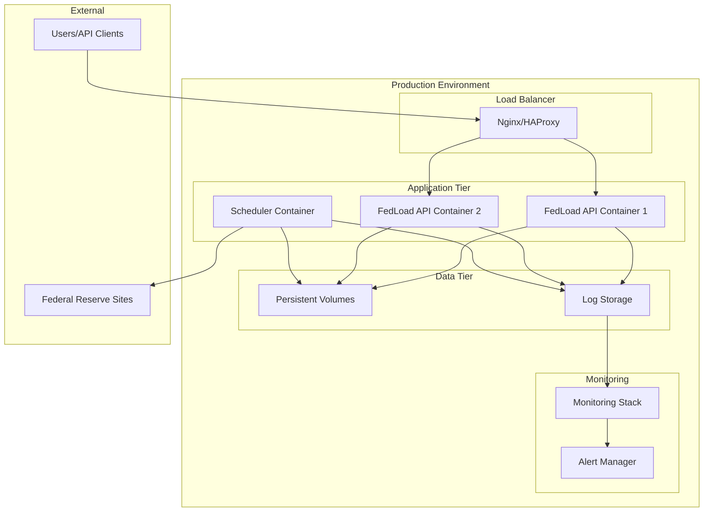
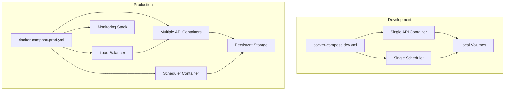

# Docker Deployment Guide

This guide explains how to build, run, and deploy the FedLoad application using Docker.

## Quick Start

### 1. Build and Run with Docker Compose (Recommended)

```bash
# Build and start all services
docker-compose up --build

# Run in background
docker-compose up -d --build

# View logs
docker-compose logs -f

# Stop services
docker-compose down
```

The application will be available at:
- **API**: http://localhost:8000
- **Health Check**: http://localhost:8000/health
- **API Docs**: http://localhost:8000/docs

### 2. Manual Docker Build

```bash
# Build the image
docker build -t fedload:latest .

# Run API server
docker run -d \
  --name fedload-api \
  -p 8000:8000 \
  -v $(pwd)/config.json:/app/config.json:ro \
  -v $(pwd)/fed_entities.json:/app/fed_entities.json:ro \
  -v fedload-logs:/app/logs \
  fedload:latest

# Run scheduler
docker run -d \
  --name fedload-scheduler \
  -v $(pwd)/config.json:/app/config.json:ro \
  -v $(pwd)/fed_entities.json:/app/fed_entities.json:ro \
  -v fedload-logs:/app/logs \
  fedload:latest python scheduler.py
```

## Configuration

### Environment Variables

| Variable | Description | Default |
|----------|-------------|---------|
| `PYTHONPATH` | Python module path | `/app` |
| `PYTHONUNBUFFERED` | Disable Python buffering | `1` |

### Volume Mounts

| Host Path | Container Path | Purpose |
|-----------|----------------|---------|
| `./config.json` | `/app/config.json` | Application configuration |
| `./fed_entities.json` | `/app/fed_entities.json` | Entity database |
| `./tracked_sites.json` | `/app/tracked_sites.json` | Sites to monitor |
| `fedload-logs` | `/app/logs` | Application logs |
| `fedload-data` | `/app/data` | Runtime data |

## Production Deployment

### Docker Compose Production

```yaml
# docker-compose.prod.yml
version: '3.8'

services:
  fedload-api:
    image: ghcr.io/yourusername/fedloadw:latest
    container_name: fedload-api-prod
    ports:
      - "8000:8000"
    environment:
      - PYTHONUNBUFFERED=1
    volumes:
      - ./config.prod.json:/app/config.json:ro
      - ./fed_entities.json:/app/fed_entities.json:ro
      - ./tracked_sites.json:/app/tracked_sites.json:ro
      - fedload-logs:/app/logs
      - fedload-data:/app/data
    restart: unless-stopped
    healthcheck:
      test: ["CMD", "curl", "-f", "http://localhost:8000/health"]
      interval: 30s
      timeout: 10s
      retries: 3
    networks:
      - fedload-network

  fedload-scheduler:
    image: ghcr.io/yourusername/fedloadw:latest
    container_name: fedload-scheduler-prod
    environment:
      - PYTHONUNBUFFERED=1
    volumes:
      - ./config.prod.json:/app/config.json:ro
      - ./fed_entities.json:/app/fed_entities.json:ro
      - ./tracked_sites.json:/app/tracked_sites.json:ro
      - fedload-logs:/app/logs
      - fedload-data:/app/data
    command: ["python", "scheduler.py"]
    restart: unless-stopped
    depends_on:
      - fedload-api
    networks:
      - fedload-network

volumes:
  fedload-logs:
    driver: local
  fedload-data:
    driver: local

networks:
  fedload-network:
    driver: bridge
```

### Kubernetes Deployment

```yaml
# k8s-deployment.yaml
apiVersion: apps/v1
kind: Deployment
metadata:
  name: fedload-api
spec:
  replicas: 2
  selector:
    matchLabels:
      app: fedload-api
  template:
    metadata:
      labels:
        app: fedload-api
    spec:
      containers:
      - name: fedload-api
        image: ghcr.io/yourusername/fedloadw:latest
        ports:
        - containerPort: 8000
        env:
        - name: PYTHONUNBUFFERED
          value: "1"
        volumeMounts:
        - name: config
          mountPath: /app/config.json
          subPath: config.json
        - name: entities
          mountPath: /app/fed_entities.json
          subPath: fed_entities.json
        livenessProbe:
          httpGet:
            path: /health
            port: 8000
          initialDelaySeconds: 30
          periodSeconds: 10
        readinessProbe:
          httpGet:
            path: /health
            port: 8000
          initialDelaySeconds: 5
          periodSeconds: 5
      volumes:
      - name: config
        configMap:
          name: fedload-config
      - name: entities
        configMap:
          name: fedload-entities
---
apiVersion: v1
kind: Service
metadata:
  name: fedload-api-service
spec:
  selector:
    app: fedload-api
  ports:
  - protocol: TCP
    port: 80
    targetPort: 8000
  type: LoadBalancer
```

## Monitoring and Logging

### View Logs

```bash
# Docker Compose
docker-compose logs -f fedload-api
docker-compose logs -f fedload-scheduler

# Docker
docker logs -f fedload-api
docker logs -f fedload-scheduler
```

### Health Monitoring

```bash
# Check health
curl http://localhost:8000/health

# Monitor with watch
watch -n 5 'curl -s http://localhost:8000/health | jq'
```

### Resource Monitoring

```bash
# Container stats
docker stats fedload-api fedload-scheduler

# Docker Compose stats
docker-compose top
```

## Troubleshooting

### Common Issues

1. **Port already in use**
   ```bash
   # Change port in docker-compose.yml
   ports:
     - "8001:8000"  # Use port 8001 instead
   ```

2. **Permission denied on volumes**
   ```bash
   # Fix permissions
   sudo chown -R 1000:1000 logs/ data/
   ```

3. **spaCy model not found**
   ```bash
   # Rebuild with fresh dependencies
   docker-compose build --no-cache
   ```

4. **Configuration not loading**
   ```bash
   # Check volume mount
   docker-compose exec fedload-api ls -la /app/config.json
   ```

### Debug Mode

```bash
# Run with debug logging
docker-compose run --rm fedload-api python main.py --debug

# Interactive shell
docker-compose exec fedload-api bash
```

## Security Considerations

### Production Security

1. **Use non-root user** (already implemented)
2. **Read-only configuration files**
3. **Network isolation**
4. **Resource limits**

```yaml
# Add to docker-compose.yml
services:
  fedload-api:
    deploy:
      resources:
        limits:
          cpus: '1.0'
          memory: 1G
        reservations:
          cpus: '0.5'
          memory: 512M
    security_opt:
      - no-new-privileges:true
    read_only: true
    tmpfs:
      - /tmp
```

### Secrets Management

```bash
# Use Docker secrets for sensitive data
echo "your-secret-key" | docker secret create api-key -

# Reference in compose file
secrets:
  - api-key
```

## Performance Optimization

### Multi-stage Build Benefits

- **Smaller image size**: Production image excludes build tools
- **Faster deployments**: Cached layers improve build speed
- **Security**: Fewer attack vectors in production image

### Resource Tuning

```yaml
# Optimize for your environment
environment:
  - WORKERS=4                    # API workers
  - MAX_REQUESTS=1000           # Requests per worker
  - TIMEOUT=30                  # Request timeout
  - KEEP_ALIVE=2                # Keep-alive timeout
```

## Backup and Recovery

### Data Backup

```bash
# Backup volumes
docker run --rm -v fedload-data:/data -v $(pwd):/backup alpine tar czf /backup/fedload-data.tar.gz -C /data .

# Restore volumes
docker run --rm -v fedload-data:/data -v $(pwd):/backup alpine tar xzf /backup/fedload-data.tar.gz -C /data
```

### Configuration Backup

```bash
# Backup configuration
cp config.json config.json.bak
cp fed_entities.json fed_entities.json.bak
cp tracked_sites.json tracked_sites.json.bak
```

## 🏗️ Architecture Overview

### Container Architecture


### Development vs Production Deployment
