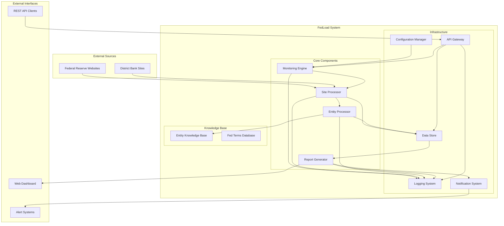
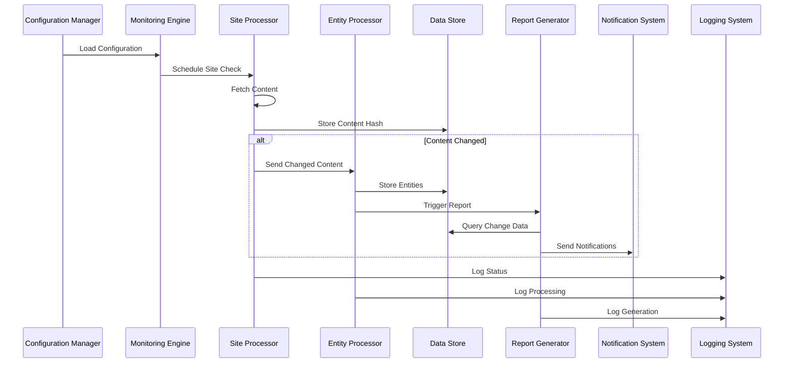
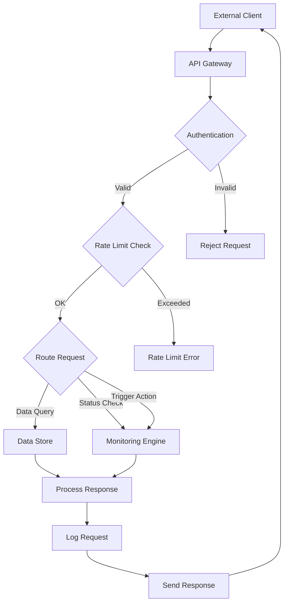
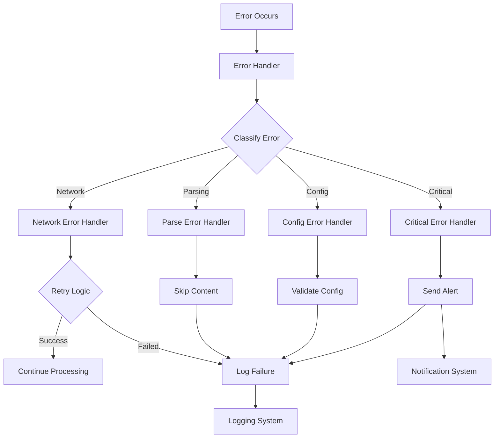

# FedLoad System Architecture

## 1. System Overview
FedLoad is a distributed monitoring system designed to track content changes across US Federal Reserve websites, extract entities, and generate reports. The architecture emphasizes modularity, scalability, and maintainability.

### 1.1 High-Level System Architecture

## 2. Core Components and Interactions

### 2.1 Monitoring Engine
**Purpose**: Orchestrates the monitoring workflow and manages scheduling
**Key Responsibilities**:
- Schedule periodic site checks
- Coordinate component interactions
- Manage system state and configuration
- Handle error recovery and retry logic

**Interactions**:
- Receives configuration from Configuration Manager
- Delegates site checking to Site Processor
- Triggers report generation based on detected changes
- Logs events through Logging System

### 2.2 Site Processor
**Purpose**: Handles individual website monitoring and change detection
**Key Responsibilities**:
- Fetch content from target URLs
- Extract and clean text content
- Compute content hashes for change detection
- Validate and sanitize content

**Interactions**:
- Receives site URLs from Monitoring Engine
- Stores content hashes in Data Store
- Sends changed content to Entity Processor
- Reports status back to Monitoring Engine

### 2.3 Entity Processor
**Purpose**: Extracts and enriches named entities from content
**Key Responsibilities**:
- Apply NLP models for entity recognition
- Enrich entities with Federal Reserve context
- Classify and categorize extracted entities
- Maintain entity knowledge base

**Interactions**:
- Receives content from Site Processor
- Queries Entity Knowledge Base
- Stores enriched entities in Data Store
- Provides entity data to Report Generator

### 2.4 Report Generator
**Purpose**: Creates comprehensive reports and summaries
**Key Responsibilities**:
- Generate daily and weekly reports
- Create entity-focused summaries
- Export reports in multiple formats
- Maintain report templates and styling

**Interactions**:
- Retrieves change data from Data Store
- Receives entity information from Entity Processor
- Outputs reports to configured destinations
- Notifies users through Notification System

### 2.5 Data Store
**Purpose**: Persistent storage for all system data
**Key Responsibilities**:
- Store content hashes and change history
- Maintain entity data and relationships
- Persist configuration and system state
- Provide data integrity and backup

**Interactions**:
- Receives data from all processing components
- Serves historical data for analysis
- Supports queries from Report Generator
- Integrates with backup and archival systems

### 2.6 Configuration Manager
**Purpose**: Centralized configuration and validation
**Key Responsibilities**:
- Load and validate system configuration
- Manage site URLs and monitoring parameters
- Handle configuration updates and migrations
- Provide configuration to all components

**Interactions**:
- Provides configuration to all system components
- Validates configuration changes
- Supports runtime configuration updates
- Integrates with external configuration sources

### 2.7 API Gateway
**Purpose**: External interface for system interaction
**Key Responsibilities**:
- Expose REST API endpoints
- Handle authentication and authorization
- Provide real-time status and data access
- Support webhook and notification endpoints

**Interactions**:
- Queries Data Store for current information
- Triggers on-demand operations
- Provides system status and metrics
- Integrates with external systems

## 3. Data Flow Architecture

### 3.1 Monitoring Workflow

### 3.2 API Request Flow

### 3.3 Error Handling Flow

## 4. Integration Patterns

### 4.1 Component Communication
- **Synchronous**: Direct function calls within process boundaries
- **Asynchronous**: Message queues for decoupled processing
- **Event-driven**: Pub/sub pattern for change notifications
- **API-based**: REST interfaces for external integrations

### 4.2 Data Persistence Patterns
- **Transactional**: ACID compliance for critical data operations
- **Append-only**: Immutable change logs for audit trails
- **Caching**: In-memory caching for frequently accessed data
- **Archival**: Long-term storage for historical analysis

### 4.3 Scalability Patterns
- **Horizontal scaling**: Multiple worker processes for site checking
- **Load balancing**: Distribute API requests across instances
- **Caching layers**: Reduce database load and improve response times
- **Asynchronous processing**: Non-blocking operations for better throughput

## 5. Security Architecture

### 5.1 Input Validation
- URL validation and sanitization
- Content size and type restrictions
- Configuration parameter validation
- API input validation and rate limiting

### 5.2 Data Protection
- Secure storage of sensitive configuration
- Encrypted communication channels
- Access control and authentication
- Audit logging for security events

### 5.3 Network Security
- Outbound connection restrictions
- Rate limiting for external requests
- SSL/TLS for all external communications
- Firewall rules and network segmentation

## 6. Monitoring and Observability

### 6.1 System Metrics
- Component health and availability
- Processing throughput and latency
- Error rates and types
- Resource utilization (CPU, memory, storage)

### 6.2 Business Metrics
- Site monitoring coverage and success rates
- Entity extraction accuracy and volume
- Report generation frequency and delivery
- User engagement and API usage

### 6.3 Alerting and Notifications
- Critical system failures
- Site accessibility issues
- Data quality problems
- Performance degradation

## 7. Deployment Architecture

### 7.1 Container Strategy
- Microservice containers for each major component
- Shared data volumes for persistent storage
- Container orchestration for scaling and management
- Health checks and automatic restart capabilities

### 7.2 Environment Separation
- Development, staging, and production environments
- Environment-specific configuration management
- Isolated data stores and external dependencies
- Promotion pipelines with validation gates

### 7.3 High Availability
- Redundant component deployment
- Database replication and failover
- Load balancing and traffic distribution
- Disaster recovery and backup procedures

## 8. Evolution and Extensibility

### 8.1 Plugin Architecture
- Extensible entity processors for custom analysis
- Configurable report formats and destinations
- Custom notification channels and integrations
- Pluggable authentication and authorization

### 8.2 API Versioning
- Backward-compatible API evolution
- Version-specific endpoint management
- Client SDK and documentation maintenance
- Deprecation and migration strategies

### 8.3 Data Schema Evolution
- Database migration and versioning
- Backward-compatible data format changes
- Data transformation and cleanup procedures
- Schema validation and integrity checks 