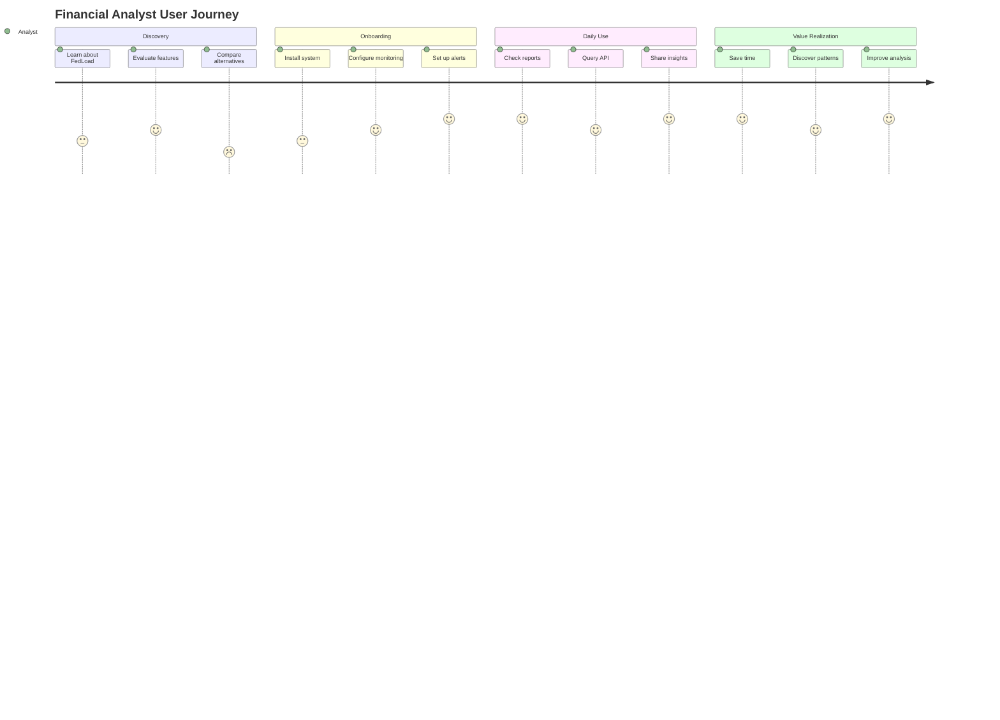
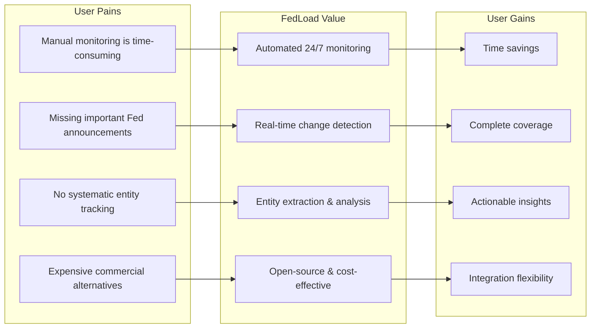

# Market Requirements Document (MRD) – FedLoad

## 1. Problem Statement
FedLoad addresses the need for automated monitoring and analysis of US Federal Reserve websites, providing timely detection of content changes, entity extraction, and reporting for financial analysts, researchers, and the public.

## 2. Target Users / Personas (Not Yet Validated)
- **Financial analysts** - Need timely Fed communication updates
- **Economic researchers** - Require systematic data collection
- **Journalists** - Need alerts on policy changes and announcements
- **Policy makers** - Monitor Fed communications and decisions
- **Public interested in Federal Reserve activities** - General awareness

*Note: User personas and their specific needs require validation through user research and feedback.*

### User Journey Map

## 3. Market Need
- No lightweight, open-source tool focused on comprehensive monitoring of all 12 district banks and key FED/FRB sites
- Need for automated change detection, entity extraction, and reporting for regulatory, research, and news purposes
- Gap in accessible tools for systematic Federal Reserve communication tracking

## 4. Competitive Landscape (Requires Research)
- **Commercial monitoring services**: Expensive, general-purpose web monitoring
- **Open-source alternatives**: Generic website monitoring tools lacking Fed-specific features
- **Manual monitoring**: Time-intensive, error-prone, not scalable
- **FedLoad unique value proposition**: Fed-focused, open-source, entity-aware monitoring

*Note: Detailed competitive analysis and positioning requires market research.*

## 5. Success Metrics - Adoption and Value
### Primary Success Indicators
- **User Adoption**: Number of active installations and users
- **Perceived Value**: User feedback indicating the tool saves time and provides insights
- **Community Engagement**: Contributions, issues, feature requests on GitHub
- **Usage Patterns**: Frequency of API calls, report generation, entity queries

### Secondary Indicators
- **Content Coverage**: Successfully monitoring all target Fed websites
- **Reliability**: Consistent uptime and change detection accuracy
- **Performance**: Reasonable response times and resource usage
- **Extensibility**: Ease of adding new sites or features

### Value Realization Metrics
- **Time Savings**: Reduction in manual monitoring effort for users
- **Insight Generation**: Discovery of patterns or changes users wouldn't find manually
- **Integration Success**: Adoption in existing workflows and tools
- **Knowledge Sharing**: Use in research, journalism, or policy analysis

### Value Proposition Canvas

## 6. Stakeholders
- **Project maintainers**: Development and maintenance responsibility
- **End users**: Analysts, researchers, journalists using the tool
- **Federal Reserve**: Indirect stakeholder as content source
- **Open source community**: Contributors and ecosystem participants

## 7. Open Questions Requiring Validation
- **User Workflows**: How do target users currently monitor Fed communications?
- **Integration Needs**: What existing tools and systems need integration?
- **Notification Preferences**: How do users want to be alerted to changes?
- **Data Export Requirements**: What formats and integrations are most valuable?
- **Regulatory Considerations**: Are there compliance requirements for monitoring?
- **Scalability Needs**: How many concurrent users and sites need support?
- **Customization Requirements**: What configuration options are essential?

## 8. Success Validation Approach
- **User Interviews**: Direct feedback from target personas
- **Usage Analytics**: Monitoring actual usage patterns and behaviors
- **Community Feedback**: GitHub issues, discussions, and contributions
- **Case Studies**: Document specific use cases and value delivered
- **Adoption Metrics**: Track growth in installations and active users 